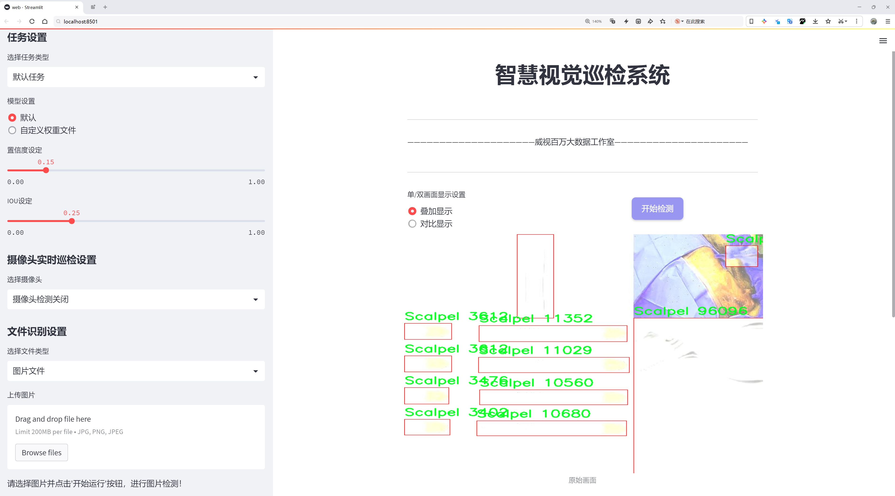
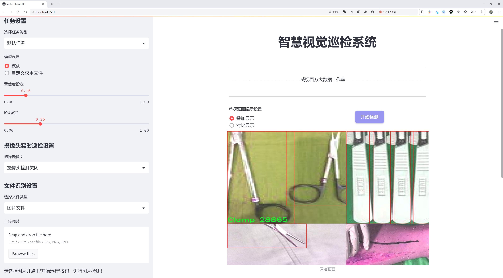
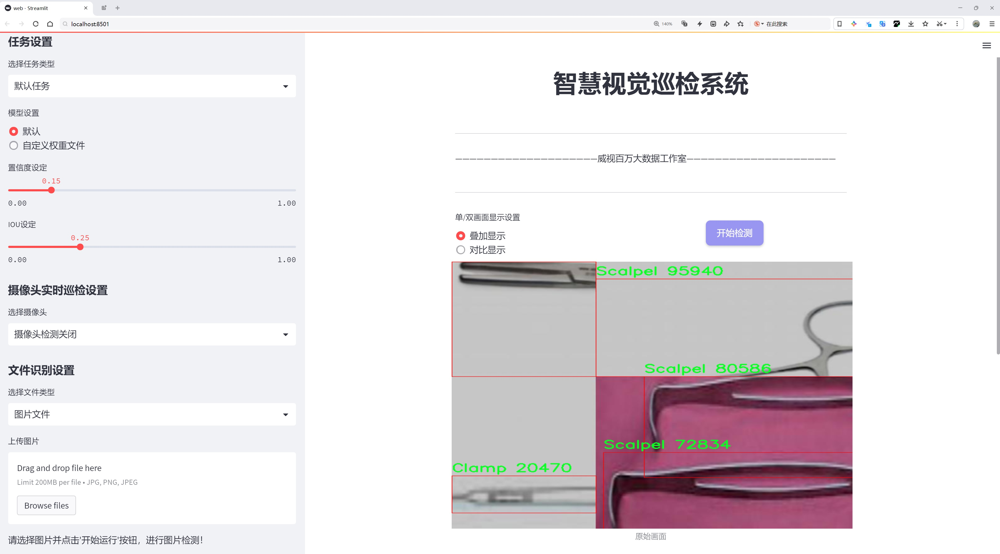
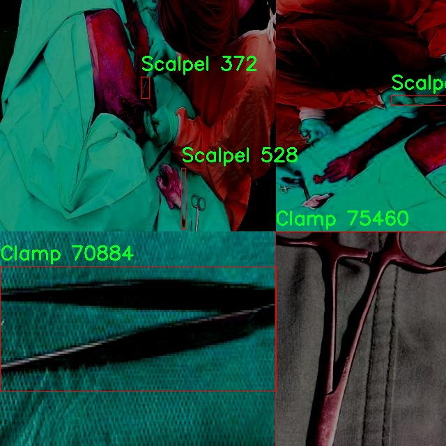
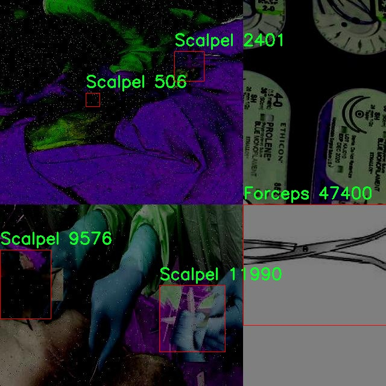
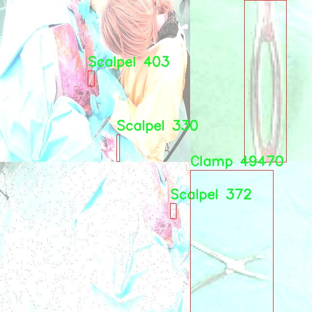
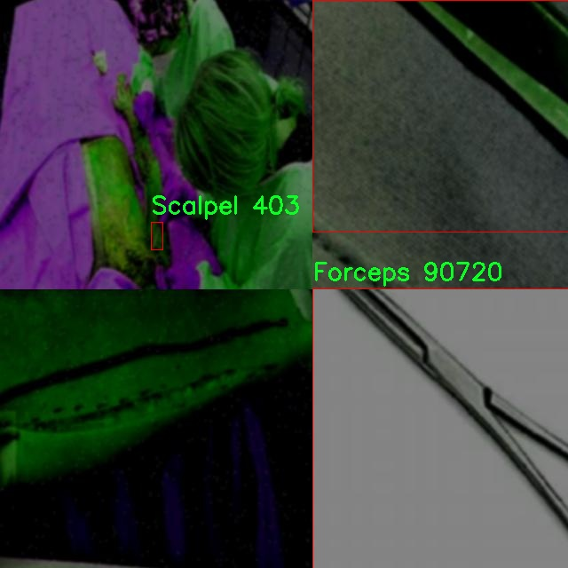
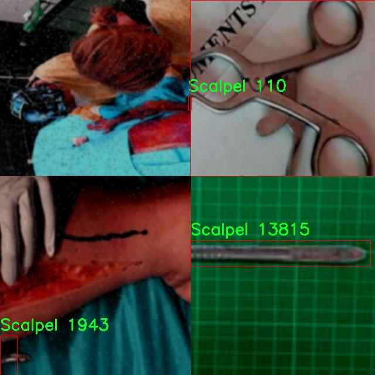

# 医疗设备检测检测系统源码分享
 # [一条龙教学YOLOV8标注好的数据集一键训练_70+全套改进创新点发刊_Web前端展示]

### 1.研究背景与意义

项目参考[AAAI Association for the Advancement of Artificial Intelligence](https://gitee.com/qunshansj/projects)

项目来源[AACV Association for the Advancement of Computer Vision](https://gitee.com/qunmasj/projects)

研究背景与意义

随着医疗技术的迅速发展，医疗设备的种类和数量不断增加，如何高效、准确地对这些设备进行检测和管理，成为了医疗行业亟待解决的重要问题。医疗设备不仅在医院的日常运作中扮演着关键角色，还直接关系到患者的健康和安全。因此，构建一个高效的医疗设备检测系统，对于提升医疗服务质量、降低医疗事故风险具有重要的现实意义。

在众多的计算机视觉技术中，目标检测技术因其在图像中识别和定位特定对象的能力，逐渐成为医疗设备管理中的重要工具。YOLO（You Only Look Once）系列模型以其快速的检测速度和较高的准确率，广泛应用于各种目标检测任务。YOLOv8作为该系列的最新版本，具备了更强的特征提取能力和更高的检测精度，适合用于复杂的医疗环境中。通过对YOLOv8模型的改进，能够进一步提升其在医疗设备检测中的表现，使其在实际应用中更加高效和可靠。

本研究基于5300张图像的数据集，涵盖了16个类别的医疗设备。这些类别的多样性不仅反映了现代医疗设备的复杂性，也为目标检测模型的训练提供了丰富的样本。在此背景下，构建一个基于改进YOLOv8的医疗设备检测系统，将为医疗机构提供一种高效的设备管理工具，能够实时监测设备的状态和位置，减少设备遗失和误用的风险。

此外，随着人工智能技术的不断进步，医疗行业也在积极探索智能化管理的路径。通过引入基于深度学习的目标检测技术，医疗设备的管理将变得更加智能化和自动化。改进YOLOv8模型的应用，不仅可以提高设备检测的准确性，还能降低人工干预的需求，从而减少人力成本，提高工作效率。

本研究的意义还在于推动医疗设备管理领域的技术创新。通过对YOLOv8模型的改进，探索其在医疗设备检测中的新应用，能够为后续相关研究提供参考和借鉴。同时，研究成果也将为医疗设备的标准化管理提供理论支持，促进医疗行业的规范化发展。

综上所述，基于改进YOLOv8的医疗设备检测系统的研究，不仅具有重要的学术价值，也具备显著的应用前景。通过对医疗设备的高效检测与管理，能够提升医疗服务的质量和安全性，为患者提供更好的医疗体验。随着研究的深入，期待能够为医疗行业的智能化转型贡献一份力量。

### 2.图片演示







##### 注意：由于此博客编辑较早，上面“2.图片演示”和“3.视频演示”展示的系统图片或者视频可能为老版本，新版本在老版本的基础上升级如下：（实际效果以升级的新版本为准）

  （1）适配了YOLOV8的“目标检测”模型和“实例分割”模型，通过加载相应的权重（.pt）文件即可自适应加载模型。

  （2）支持“图片识别”、“视频识别”、“摄像头实时识别”三种识别模式。

  （3）支持“图片识别”、“视频识别”、“摄像头实时识别”三种识别结果保存导出，解决手动导出（容易卡顿出现爆内存）存在的问题，识别完自动保存结果并导出到tempDir中。

  （4）支持Web前端系统中的标题、背景图等自定义修改，后面提供修改教程。

  另外本项目提供训练的数据集和训练教程,暂不提供权重文件（best.pt）,需要您按照教程进行训练后实现图片演示和Web前端界面演示的效果。

### 3.视频演示

[3.1 视频演示](https://www.bilibili.com/video/BV1jd4fe9Etd/)

### 4.数据集信息展示

##### 4.1 本项目数据集详细数据（类别数＆类别名）

nc: 4
names: ['Clamp', 'Forceps', 'Needle', 'Scalpel']


##### 4.2 本项目数据集信息介绍

数据集信息展示

在医疗设备检测系统的研究中，数据集的构建与选择至关重要。本研究所采用的数据集名为“Detecting Equipment”，其设计旨在为改进YOLOv8模型提供高质量的训练数据，以实现对医疗设备的精准检测与分类。该数据集包含四个主要类别，分别是夹具（Clamp）、镊子（Forceps）、针（Needle）和手术刀（Scalpel）。这些类别涵盖了医疗操作中常见的基本工具，能够有效支持模型在实际应用中的表现。

“Detecting Equipment”数据集的构建过程充分考虑了医疗设备的多样性与复杂性。每个类别都经过精心挑选，确保所包含的样本能够代表实际医疗环境中设备的外观和使用场景。夹具作为一种常用的医疗工具，通常用于固定或夹持组织，其形状和尺寸的多样性为模型的学习提供了丰富的样本。镊子则是外科手术中不可或缺的工具，常用于抓取和操作细小的组织，数据集中包含的镊子样本涵盖了不同类型和用途的镊子，确保模型能够识别各种形态的镊子。

针的类别同样重要，针在医疗操作中被广泛使用，尤其是在注射和缝合过程中。数据集中收录的针样本不仅包括不同尺寸和形状的针，还考虑了针的包装和使用状态，以增强模型对实际应用场景的适应能力。手术刀作为外科手术中最基本的工具，其样本的多样性同样不可忽视。数据集中包含了多种类型的手术刀，确保模型能够识别不同的刀具及其在手术中的应用。

为了提高数据集的有效性和可靠性，所有样本均经过严格的标注和审核。每个类别的样本都附有详细的标签信息，包括设备的名称、类别及其在医疗操作中的具体用途。这种详细的标注不仅有助于模型的训练过程，也为后续的模型评估和优化提供了坚实的基础。此外，数据集还考虑了不同的拍摄角度、光照条件和背景环境，以增强模型的鲁棒性，使其能够在多变的实际应用中保持高效的检测能力。

在数据集的使用过程中，研究者们可以利用这些丰富的样本进行模型的训练与验证，确保YOLOv8在医疗设备检测任务中的表现达到最佳。通过不断迭代和优化，基于“Detecting Equipment”数据集的模型将能够在实际医疗环境中实现高效、准确的设备识别，为医疗工作者提供更为可靠的支持。

综上所述，“Detecting Equipment”数据集不仅在类别选择上具有针对性，其样本的多样性和标注的精确性也为YOLOv8模型的训练提供了强有力的支持。通过对该数据集的深入研究与应用，医疗设备检测系统的性能将得到显著提升，为未来的医疗实践带来更多的可能性。











### 5.全套项目环境部署视频教程（零基础手把手教学）

[5.1 环境部署教程链接（零基础手把手教学）](https://www.ixigua.com/7404473917358506534?logTag=c807d0cbc21c0ef59de5)


[5.2 安装Python虚拟环境创建和依赖库安装视频教程链接（零基础手把手教学）](https://www.ixigua.com/7404474678003106304?logTag=1f1041108cd1f708b01a)

### 6.手把手YOLOV8训练视频教程（零基础小白有手就能学会）

[6.1 手把手YOLOV8训练视频教程（零基础小白有手就能学会）](https://www.ixigua.com/7404477157818401292?logTag=d31a2dfd1983c9668658)

### 7.70+种全套YOLOV8创新点代码加载调参视频教程（一键加载写好的改进模型的配置文件）

[7.1 70+种全套YOLOV8创新点代码加载调参视频教程（一键加载写好的改进模型的配置文件）](https://www.ixigua.com/7404478314661806627?logTag=29066f8288e3f4eea3a4)

### 8.70+种全套YOLOV8创新点原理讲解（非科班也可以轻松写刊发刊，V10版本正在科研待更新）

由于篇幅限制，每个创新点的具体原理讲解就不一一展开，具体见下列网址中的创新点对应子项目的技术原理博客网址【Blog】：


[8.1 70+种全套YOLOV8创新点原理讲解链接](https://gitee.com/qunmasj/good)

### 9.系统功能展示（检测对象为举例，实际内容以本项目数据集为准）

图9.1.系统支持检测结果表格显示

  图9.2.系统支持置信度和IOU阈值手动调节

  图9.3.系统支持自定义加载权重文件best.pt(需要你通过步骤5中训练获得)

  图9.4.系统支持摄像头实时识别

  图9.5.系统支持图片识别

  图9.6.系统支持视频识别

  图9.7.系统支持识别结果文件自动保存

  图9.8.系统支持Excel导出检测结果数据


### 10.原始YOLOV8算法原理

原始YOLOv8算法原理

YOLOv8是Ultralytics公司在2023年推出的最新目标检测算法，标志着YOLO系列的又一次重大进化。该算法在以往YOLO版本的基础上进行了多项创新，旨在提高目标检测的精度和速度，同时保持易用性和灵活性。YOLOv8的设计理念围绕着快速、准确和用户友好展开，使其在目标检测、图像分割和图像分类等任务中成为一种理想的选择。

YOLOv8的网络结构主要由四个部分组成：输入层、主干网络（Backbone）、特征融合网络（Neck）和检测模块（Head）。在输入层，YOLOv8采用了640x640的默认图像尺寸，但为了适应不同长宽比的图像，算法在推理时使用自适应图像缩放技术。这种方法通过将较长的一边按比例缩小到指定尺寸，然后对短边进行填充，从而有效减少了信息冗余，提升了目标检测的速度。此外，在训练过程中，YOLOv8引入了Mosaic图像增强技术，这一技术通过随机拼接四张不同的图像，增强了模型对不同位置和周围像素的学习能力，从而提高了预测精度。

在主干网络部分，YOLOv8的设计借鉴了YOLOv7中的ELAN模块，将YOLOv5中的C3模块替换为C2F模块。C2F模块通过并行多个梯度流分支，增强了信息流动的丰富性，同时保持了模型的轻量化特性。这种设计使得YOLOv8在处理不同规模的特征时，能够更好地捕捉到重要信息，进而提升了检测精度。

YOLOv8的Neck部分同样经历了重要的改进。与YOLOv5相比，YOLOv8在Neck中去除了多余的卷积连接层，直接对主干网络不同阶段输出的特征进行上采样。这种简化的结构有助于更高效地融合特征，提升了模型对不同尺度目标的检测能力。YOLOv8的Neck部分结合了特征金字塔和路径聚合网络的设计，进一步增强了语义和定位特征的转移能力，使得网络能够获取更丰富的特征信息。

在检测模块（Head）中，YOLOv8进行了最显著的变化。它从Coupled-Head（耦合头）转变为Decoupled-Head（解耦头），将检测和分类的卷积分开处理。这一设计使得模型在进行类别预测和边界框回归时，能够更加专注于各自的任务，从而加速了模型的收敛过程。此外，YOLOv8抛弃了传统的Anchor-Based（基于锚框）方法，转而采用Anchor-Free（无锚框）策略。这一转变不仅简化了模型结构，还提高了模型的泛化能力，使得YOLOv8在处理不同数据集时更加灵活。

YOLOv8的损失函数设计也进行了创新，针对训练和推理过程中存在的逻辑不一致性，取消了Obj分支。在分类分支中，YOLOv8依然采用了二值交叉熵损失（BCELoss），而在边界框回归分支中则使用了分布焦点损失（DFL）和CIoU损失。这种损失函数的组合使得网络能够更快地聚焦于标签附近的数值，提高了模型的预测精度。

总的来说，YOLOv8通过引入多项创新和改进，显著提升了目标检测的性能。其在各个模块中的优化设计，使得YOLOv8不仅在检测精度上表现优异，同时在速度和灵活性方面也有了显著提升。这些特性使得YOLOv8在实际应用中具有广泛的适用性，能够满足不同场景下的目标检测需求。

随着YOLOv8的发布，目标检测领域迎来了新的机遇。其高效的检测能力和灵活的结构设计，将为各类应用场景提供强有力的支持，尤其是在实时检测和自动化任务中，YOLOv8展现出了巨大的潜力。无论是在工业检测、智能监控，还是在自动驾驶和机器人视觉等领域，YOLOv8都将发挥重要作用，推动目标检测技术的进一步发展。


### 11.项目核心源码讲解（再也不用担心看不懂代码逻辑）

#### 11.1 70+种YOLOv8算法改进源码大全和调试加载训练教程（非必要）\ultralytics\hub\utils.py

以下是经过精简和注释的核心代码部分：

```python
import os
import random
import sys
import threading
import time
from pathlib import Path
import requests
from ultralytics.utils import (ENVIRONMENT, LOGGER, ONLINE, RANK, SETTINGS, TESTS_RUNNING, TryExcept, __version__,
                               is_git_dir, is_pip_package)

# 定义事件上报的URL
EVENTS_URL = 'https://www.google-analytics.com/mp/collect?measurement_id=G-X8NCJYTQXM&api_secret=QLQrATrNSwGRFRLE-cbHJw'

class Events:
    """
    事件分析类，用于收集匿名事件分析数据。
    当设置中的sync=True时启用事件分析，sync=False时禁用。
    """

    def __init__(self):
        """初始化事件对象，设置默认值。"""
        self.events = []  # 事件列表
        self.rate_limit = 60.0  # 事件上报的速率限制（秒）
        self.t = 0.0  # 速率限制计时器（秒）
        self.metadata = {
            'cli': Path(sys.argv[0]).name == 'yolo',  # 检查是否为yolo命令行工具
            'install': 'git' if is_git_dir() else 'pip' if is_pip_package() else 'other',  # 安装方式
            'python': '.'.join(sys.version.split('.')[:2]),  # Python版本
            'version': __version__,  # 当前版本
            'env': ENVIRONMENT,  # 环境信息
            'session_id': round(random.random() * 1E15),  # 随机生成的会话ID
            'engagement_time_msec': 1000  # 参与时间（毫秒）
        }
        # 启用条件：sync为True，RANK为-1或0，未在测试中，在线状态，且为pip或git安装
        self.enabled = (
            SETTINGS['sync'] and 
            RANK in (-1, 0) and 
            not TESTS_RUNNING and 
            ONLINE and 
            (is_pip_package() or is_git_dir())
        )

    def __call__(self, cfg):
        """
        尝试添加新事件到事件列表，并在达到速率限制时发送事件。

        Args:
            cfg (IterableSimpleNamespace): 包含模式和任务信息的配置对象。
        """
        if not self.enabled:
            return  # 如果事件分析未启用，则返回

        # 添加事件到列表，最多25个事件
        if len(self.events) < 25:
            params = {
                **self.metadata, 
                'task': cfg.task,
                'model': cfg.model if cfg.model in GITHUB_ASSETS_NAMES else 'custom'
            }
            if cfg.mode == 'export':
                params['format'] = cfg.format
            self.events.append({'name': cfg.mode, 'params': params})

        # 检查速率限制
        current_time = time.time()
        if (current_time - self.t) < self.rate_limit:
            return  # 如果未超过速率限制，则返回

        # 超过速率限制，发送事件
        data = {'client_id': SETTINGS['uuid'], 'events': self.events}  # 客户端ID和事件列表
        smart_request('post', EVENTS_URL, json=data, retry=0, verbose=False)  # 发送POST请求

        # 重置事件列表和速率限制计时器
        self.events = []
        self.t = current_time

# 初始化事件对象
events = Events()
```

### 代码注释说明：
1. **导入必要的库**：引入了操作系统、随机数、线程、时间、路径处理和请求库等。
2. **事件上报URL**：定义了用于发送事件数据的Google Analytics URL。
3. **Events类**：负责收集和发送事件数据，包含初始化和事件添加的逻辑。
4. **初始化方法**：设置事件列表、速率限制、元数据和启用条件。
5. **调用方法**：尝试添加事件并在达到速率限制时发送事件数据，使用`smart_request`进行HTTP POST请求。
6. **事件列表限制**：最多存储25个事件，超过则不再添加。
7. **速率限制检查**：确保在发送事件时遵循速率限制。
8. **事件发送**：通过HTTP POST请求将事件数据发送到指定的URL，并在发送后重置事件列表和计时器。

这个文件是Ultralytics YOLO项目中的一个工具模块，主要用于处理与HTTP请求、事件收集和一些环境检测相关的功能。代码的开头引入了一些必要的库和模块，包括操作系统、网络请求、线程处理等。

文件中定义了几个主要的函数和一个类。首先，`request_with_credentials`函数用于在Google Colab环境中进行带有凭证的AJAX请求。它确保在Colab环境中运行，并使用JavaScript代码发送POST请求以获取响应数据。

接下来，`requests_with_progress`函数允许用户进行HTTP请求，并在下载过程中显示进度条。它会根据响应的内容长度来更新进度条，提供用户友好的体验。

`smart_request`函数则是一个更复杂的HTTP请求处理函数，支持重试机制和超时设置。它会在请求失败时根据设定的重试次数和超时限制进行重试，并且可以选择在单独的线程中执行请求。这个函数还支持进度条显示，方便用户监控请求的进度。

`Events`类用于收集匿名事件分析数据。它的构造函数初始化了一些默认值，包括事件列表、速率限制和元数据。该类的主要功能是收集事件并在达到速率限制时发送到指定的URL。事件的收集和发送是根据配置文件中的设置进行的，确保只有在特定条件下才会启用事件收集。

在文件的最后，创建了`Events`类的一个实例，以便在后续的代码中使用。整体来看，这个模块为YOLO项目提供了重要的网络请求和事件跟踪功能，帮助开发者在使用过程中进行数据收集和调试。

#### 11.2 code\ultralytics\utils\autobatch.py

以下是经过简化并注释的核心代码部分，主要功能是自动估算YOLO模型的最佳批量大小，以便在PyTorch中使用可用的CUDA内存。

```python
import numpy as np
import torch
from ultralytics.utils import LOGGER, colorstr
from ultralytics.utils.torch_utils import profile

def autobatch(model, imgsz=640, fraction=0.60, batch_size=16):
    """
    自动估算YOLO模型的最佳批量大小，以使用可用CUDA内存的一部分。

    参数:
        model (torch.nn.Module): 要计算批量大小的YOLO模型。
        imgsz (int): 输入YOLO模型的图像大小，默认为640。
        fraction (float): 要使用的可用CUDA内存的比例，默认为0.60。
        batch_size (int): 如果检测到错误，则使用的默认批量大小，默认为16。

    返回:
        (int): 最优批量大小。
    """

    # 检查设备
    prefix = colorstr("AutoBatch: ")
    LOGGER.info(f"{prefix}计算图像大小为 {imgsz} 的最优批量大小")
    device = next(model.parameters()).device  # 获取模型所在设备

    # 如果设备是CPU，返回默认批量大小
    if device.type == "cpu":
        LOGGER.info(f"{prefix}未检测到CUDA，使用默认CPU批量大小 {batch_size}")
        return batch_size

    # 检查CUDA内存
    gb = 1 << 30  # 字节转GiB (1024 ** 3)
    properties = torch.cuda.get_device_properties(device)  # 获取设备属性
    total_memory = properties.total_memory / gb  # 总内存（GiB）
    reserved_memory = torch.cuda.memory_reserved(device) / gb  # 保留内存（GiB）
    allocated_memory = torch.cuda.memory_allocated(device) / gb  # 已分配内存（GiB）
    free_memory = total_memory - (reserved_memory + allocated_memory)  # 可用内存（GiB）
    
    LOGGER.info(f"{prefix}{device} ({properties.name}) {total_memory:.2f}G 总, {reserved_memory:.2f}G 保留, {allocated_memory:.2f}G 已分配, {free_memory:.2f}G 可用")

    # 配置批量大小
    batch_sizes = [1, 2, 4, 8, 16]  # 预定义的批量大小
    try:
        # 创建不同批量大小的空张量
        img = [torch.empty(b, 3, imgsz, imgsz) for b in batch_sizes]
        results = profile(img, model, n=3, device=device)  # 进行性能分析

        # 拟合线性模型以估算最佳批量大小
        memory_usage = [x[2] for x in results if x]  # 提取内存使用情况
        p = np.polyfit(batch_sizes[: len(memory_usage)], memory_usage, deg=1)  # 一次多项式拟合
        optimal_batch_size = int((free_memory * fraction - p[1]) / p[0])  # 计算最佳批量大小

        # 检查是否有失败的批量大小
        if None in results:
            fail_index = results.index(None)  # 找到第一个失败的索引
            if optimal_batch_size >= batch_sizes[fail_index]:  # 如果最佳批量大小在失败点之后
                optimal_batch_size = batch_sizes[max(fail_index - 1, 0)]  # 选择安全的前一个点

        # 检查最佳批量大小是否在安全范围内
        if optimal_batch_size < 1 or optimal_batch_size > 1024:
            optimal_batch_size = batch_size
            LOGGER.info(f"{prefix}警告 ⚠️ 检测到CUDA异常，使用默认批量大小 {batch_size}.")

        # 记录实际使用的内存比例
        fraction_used = (np.polyval(p, optimal_batch_size) + reserved_memory + allocated_memory) / total_memory
        LOGGER.info(f"{prefix}使用批量大小 {optimal_batch_size}，内存使用 {total_memory * fraction_used:.2f}G/{total_memory:.2f}G ({fraction_used * 100:.0f}%) ✅")
        return optimal_batch_size
    except Exception as e:
        LOGGER.warning(f"{prefix}警告 ⚠️ 检测到错误: {e}, 使用默认批量大小 {batch_size}.")
        return batch_size
```

### 代码说明：
1. **导入必要的库**：导入NumPy和PyTorch，以及Ultralytics库中的日志和配置工具。
2. **`autobatch`函数**：该函数用于自动计算YOLO模型的最佳批量大小。
   - **参数**：
     - `model`：待分析的YOLO模型。
     - `imgsz`：输入图像的大小。
     - `fraction`：希望使用的CUDA内存比例。
     - `batch_size`：默认批量大小。
   - **内存检查**：获取CUDA设备的内存信息，包括总内存、保留内存和已分配内存，并计算可用内存。
   - **批量大小分析**：通过创建不同批量大小的空张量，使用`profile`函数进行性能分析，提取内存使用情况并拟合线性模型来估算最佳批量大小。
   - **异常处理**：如果发生错误，返回默认批量大小并记录警告信息。

这个程序文件是用于估算在PyTorch中使用YOLO模型时最佳批量大小的工具，目的是在可用的CUDA内存中使用一定比例的内存。程序首先导入了一些必要的库和模块，包括深拷贝、NumPy和PyTorch，以及Ultralytics库中的一些工具函数和常量。

在`check_train_batch_size`函数中，程序接收一个YOLO模型、图像大小和一个布尔值（表示是否使用自动混合精度AMP）作为参数。该函数的主要功能是通过调用`autobatch`函数来计算最佳的训练批量大小。使用`torch.cuda.amp.autocast`上下文管理器可以在计算过程中自动处理混合精度，从而提高训练效率。

`autobatch`函数是核心功能，它接收YOLO模型、图像大小、内存使用比例和默认批量大小作为参数。首先，函数检查模型所在的设备。如果设备是CPU，则直接返回默认的批量大小。如果CUDA可用，但`torch.backends.cudnn.benchmark`被设置为True，函数也会返回默认的批量大小。

接下来，程序会检查CUDA内存的使用情况，包括总内存、保留内存和已分配内存，从而计算出可用的自由内存。然后，程序会定义一组批量大小（1, 2, 4, 8, 16），并尝试创建相应大小的空张量以进行性能分析。通过调用`profile`函数，程序会测量不同批量大小下的内存使用情况。

通过对测量结果进行线性拟合，程序可以计算出最佳的批量大小。如果在某些批量大小的测试中出现错误，程序会选择上一个安全的批量大小作为返回值。此外，程序还会检查计算出的批量大小是否在安全范围内（1到1024之间），如果不在，则返回默认的批量大小。

最后，程序会记录所使用的批量大小和实际的内存使用比例，并在出现异常时发出警告，确保在CUDA异常情况下使用默认的批量大小。整个过程通过日志记录提供了详细的信息，方便用户了解内存的使用情况和批量大小的选择过程。

#### 11.3 ui.py

```python
import sys
import subprocess

def run_script(script_path):
    """
    使用当前 Python 环境运行指定的脚本。

    Args:
        script_path (str): 要运行的脚本路径

    Returns:
        None
    """
    # 获取当前 Python 解释器的路径
    python_path = sys.executable

    # 构建运行命令，使用 streamlit 运行指定的脚本
    command = f'"{python_path}" -m streamlit run "{script_path}"'

    # 执行命令
    result = subprocess.run(command, shell=True)
    # 检查命令执行结果，如果返回码不为0，则表示出错
    if result.returncode != 0:
        print("脚本运行出错。")

# 主程序入口
if __name__ == "__main__":
    # 指定要运行的脚本路径
    script_path = "web.py"  # 这里可以直接指定脚本路径

    # 调用函数运行脚本
    run_script(script_path)
```

### 代码核心部分及注释说明：

1. **导入模块**：
   - `sys`：用于获取当前 Python 解释器的路径。
   - `subprocess`：用于执行外部命令。

2. **定义 `run_script` 函数**：
   - 该函数接收一个参数 `script_path`，表示要运行的 Python 脚本的路径。
   - 使用 `sys.executable` 获取当前 Python 解释器的路径。
   - 构建一个命令字符串，使用 `streamlit` 模块运行指定的脚本。
   - 使用 `subprocess.run` 执行构建的命令，并检查返回码以判断脚本是否成功运行。

3. **主程序入口**：
   - 在 `if __name__ == "__main__":` 块中，指定要运行的脚本路径（此处为 `web.py`）。
   - 调用 `run_script` 函数来执行指定的脚本。

这个程序文件名为 `ui.py`，主要功能是通过当前的 Python 环境来运行一个指定的脚本，具体是使用 Streamlit 框架来启动一个 Web 应用。

程序首先导入了必要的模块，包括 `sys`、`os` 和 `subprocess`，这些模块分别用于获取系统信息、处理文件路径和执行外部命令。此外，还导入了 `abs_path` 函数，这个函数来自于 `QtFusion.path` 模块，可能用于获取文件的绝对路径。

在 `run_script` 函数中，首先定义了一个参数 `script_path`，用于接收要运行的脚本的路径。函数内部通过 `sys.executable` 获取当前 Python 解释器的路径，这样可以确保使用正确的 Python 环境来执行脚本。接着，构建了一个命令字符串，使用 `streamlit run` 命令来运行指定的脚本。

随后，使用 `subprocess.run` 方法执行构建好的命令。该方法的 `shell=True` 参数表示在 shell 中执行命令。执行完命令后，检查返回码 `result.returncode`，如果不为 0，说明脚本运行过程中出现了错误，此时打印出错误信息。

在文件的最后部分，使用 `if __name__ == "__main__":` 来判断当前模块是否是主程序。如果是主程序，则指定要运行的脚本路径为 `web.py`，并调用 `run_script` 函数来执行这个脚本。`abs_path("web.py")` 可能会将相对路径转换为绝对路径，以确保能够正确找到并运行该脚本。

总的来说，这个程序的主要作用是为用户提供一个简单的接口，通过命令行运行一个 Streamlit Web 应用脚本。

#### 11.4 train.py

以下是经过简化和注释的核心代码部分，主要关注于YOLO模型的训练过程：

```python
import random
import numpy as np
import torch.nn as nn
from ultralytics.data import build_dataloader, build_yolo_dataset
from ultralytics.engine.trainer import BaseTrainer
from ultralytics.models import yolo
from ultralytics.nn.tasks import DetectionModel
from ultralytics.utils import LOGGER, RANK
from ultralytics.utils.torch_utils import de_parallel, torch_distributed_zero_first

class DetectionTrainer(BaseTrainer):
    """
    基于检测模型的训练类，继承自BaseTrainer类。
    """

    def build_dataset(self, img_path, mode="train", batch=None):
        """
        构建YOLO数据集。

        参数:
            img_path (str): 包含图像的文件夹路径。
            mode (str): 模式，'train'或'val'，用于自定义不同的增强方式。
            batch (int, optional): 批量大小，仅用于'rect'模式。默认为None。
        """
        gs = max(int(de_parallel(self.model).stride.max() if self.model else 0), 32)
        return build_yolo_dataset(self.args, img_path, batch, self.data, mode=mode, rect=mode == "val", stride=gs)

    def get_dataloader(self, dataset_path, batch_size=16, rank=0, mode="train"):
        """构建并返回数据加载器。"""
        assert mode in ["train", "val"]
        with torch_distributed_zero_first(rank):  # DDP模式下仅初始化一次数据集
            dataset = self.build_dataset(dataset_path, mode, batch_size)
        shuffle = mode == "train"  # 训练模式下打乱数据
        workers = self.args.workers if mode == "train" else self.args.workers * 2
        return build_dataloader(dataset, batch_size, workers, shuffle, rank)  # 返回数据加载器

    def preprocess_batch(self, batch):
        """对图像批次进行预处理，包括缩放和转换为浮点数。"""
        batch["img"] = batch["img"].to(self.device, non_blocking=True).float() / 255  # 将图像归一化到[0, 1]
        if self.args.multi_scale:  # 如果启用多尺度训练
            imgs = batch["img"]
            sz = (
                random.randrange(self.args.imgsz * 0.5, self.args.imgsz * 1.5 + self.stride)
                // self.stride
                * self.stride
            )  # 随机选择图像大小
            sf = sz / max(imgs.shape[2:])  # 计算缩放因子
            if sf != 1:
                ns = [
                    math.ceil(x * sf / self.stride) * self.stride for x in imgs.shape[2:]
                ]  # 计算新的图像形状
                imgs = nn.functional.interpolate(imgs, size=ns, mode="bilinear", align_corners=False)  # 调整图像大小
            batch["img"] = imgs
        return batch

    def get_model(self, cfg=None, weights=None, verbose=True):
        """返回YOLO检测模型。"""
        model = DetectionModel(cfg, nc=self.data["nc"], verbose=verbose and RANK == -1)  # 创建检测模型
        if weights:
            model.load(weights)  # 加载权重
        return model

    def plot_training_samples(self, batch, ni):
        """绘制带有注释的训练样本。"""
        plot_images(
            images=batch["img"],
            batch_idx=batch["batch_idx"],
            cls=batch["cls"].squeeze(-1),
            bboxes=batch["bboxes"],
            paths=batch["im_file"],
            fname=self.save_dir / f"train_batch{ni}.jpg",
            on_plot=self.on_plot,
        )

    def plot_metrics(self):
        """从CSV文件中绘制指标。"""
        plot_results(file=self.csv, on_plot=self.on_plot)  # 保存结果图
```

### 代码说明：
1. **类定义**：`DetectionTrainer`类继承自`BaseTrainer`，用于实现YOLO模型的训练。
2. **数据集构建**：`build_dataset`方法根据给定的图像路径和模式构建YOLO数据集。
3. **数据加载器**：`get_dataloader`方法创建数据加载器，支持分布式训练。
4. **批处理预处理**：`preprocess_batch`方法对输入图像进行归一化和缩放处理，以适应模型输入。
5. **模型获取**：`get_model`方法返回YOLO检测模型，并可选择加载预训练权重。
6. **绘图功能**：`plot_training_samples`和`plot_metrics`方法用于可视化训练样本和训练指标。

通过这些核心功能，`DetectionTrainer`类实现了YOLO模型的训练和评估流程。

这个程序文件 `train.py` 是一个用于训练 YOLO（You Only Look Once）目标检测模型的 Python 脚本，属于 Ultralytics YOLO 项目的一部分。它继承自 `BaseTrainer` 类，专注于目标检测任务。以下是对代码的详细讲解。

首先，程序导入了一些必要的库和模块，包括数学运算、随机数生成、深度学习相关的 PyTorch 模块，以及 Ultralytics 提供的用于数据处理、模型构建和训练的工具函数和类。

在 `DetectionTrainer` 类中，定义了多个方法来处理数据集的构建、数据加载、模型的预处理、模型属性的设置、模型的获取、验证器的获取、损失项的标记、训练进度的字符串格式化、训练样本的绘图、指标的绘图和训练标签的绘图等。

`build_dataset` 方法用于构建 YOLO 数据集，接受图像路径、模式（训练或验证）和批次大小作为参数。它通过调用 `build_yolo_dataset` 函数来生成数据集，并根据模式设置不同的增强策略。

`get_dataloader` 方法用于构建并返回数据加载器，确保在分布式训练中只初始化一次数据集。它根据模式决定是否打乱数据，并设置工作线程的数量。

`preprocess_batch` 方法负责对图像批次进行预处理，包括将图像缩放到适当的大小并转换为浮点数格式。该方法还支持多尺度训练，随机选择图像大小进行训练。

`set_model_attributes` 方法用于设置模型的属性，包括类别数量和类别名称等。这些属性将帮助模型在训练过程中正确处理数据。

`get_model` 方法返回一个 YOLO 检测模型实例，可以选择加载预训练权重。

`get_validator` 方法返回一个用于验证 YOLO 模型的验证器，帮助评估模型在验证集上的表现。

`label_loss_items` 方法用于返回带有标签的训练损失项字典，便于在训练过程中跟踪损失。

`progress_string` 方法返回一个格式化的字符串，显示训练进度，包括当前的 epoch、GPU 内存使用情况、损失值、实例数量和图像大小等信息。

`plot_training_samples` 方法用于绘制训练样本及其标注，便于可视化训练数据的质量。

`plot_metrics` 方法用于从 CSV 文件中绘制训练指标，生成训练过程中的性能图。

最后，`plot_training_labels` 方法创建一个带标签的训练图，展示数据集中所有标注的边界框和类别信息。

总体来说，这个文件实现了 YOLO 模型训练的核心功能，包括数据处理、模型构建、训练过程监控和结果可视化，为用户提供了一个完整的训练框架。

#### 11.5 code\ultralytics\models\rtdetr\model.py

```python
# Ultralytics YOLO 🚀, AGPL-3.0 license
"""
RT-DETR模型接口，基于视觉变换器的实时目标检测器。RT-DETR在CUDA和TensorRT等加速后端上提供实时性能和高准确性。
它具有高效的混合编码器和IoU感知查询选择，以提高检测准确性。
"""

from ultralytics.engine.model import Model  # 导入基础模型类
from ultralytics.nn.tasks import RTDETRDetectionModel  # 导入RT-DETR检测模型

from .predict import RTDETRPredictor  # 导入预测器
from .train import RTDETRTrainer  # 导入训练器
from .val import RTDETRValidator  # 导入验证器


class RTDETR(Model):
    """
    RT-DETR模型接口。该基于视觉变换器的目标检测器提供实时性能和高准确性。
    支持高效的混合编码、IoU感知查询选择和可调的推理速度。

    属性:
        model (str): 预训练模型的路径，默认为'rtdetr-l.pt'。
    """

    def __init__(self, model="rtdetr-l.pt") -> None:
        """
        使用给定的预训练模型文件初始化RT-DETR模型。支持.pt和.yaml格式。

        参数:
            model (str): 预训练模型的路径，默认为'rtdetr-l.pt'。

        异常:
            NotImplementedError: 如果模型文件扩展名不是'pt'、'yaml'或'yml'。
        """
        # 检查模型文件的扩展名是否有效
        if model and model.split(".")[-1] not in ("pt", "yaml", "yml"):
            raise NotImplementedError("RT-DETR只支持从*.pt、*.yaml或*.yml文件创建。")
        # 调用父类构造函数进行初始化
        super().__init__(model=model, task="detect")

    @property
    def task_map(self) -> dict:
        """
        返回RT-DETR的任务映射，将任务与相应的Ultralytics类关联。

        返回:
            dict: 一个字典，将任务名称映射到RT-DETR模型的Ultralytics任务类。
        """
        return {
            "detect": {
                "predictor": RTDETRPredictor,  # 预测器类
                "validator": RTDETRValidator,  # 验证器类
                "trainer": RTDETRTrainer,      # 训练器类
                "model": RTDETRDetectionModel,  # RT-DETR检测模型类
            }
        }
```

### 代码核心部分说明
1. **类定义**: `RTDETR`类继承自`Model`，是RT-DETR模型的接口，负责初始化和任务映射。
2. **初始化方法**: `__init__`方法用于初始化模型，检查模型文件的格式是否支持（仅支持`.pt`、`.yaml`和`.yml`）。
3. **任务映射**: `task_map`属性返回一个字典，映射了检测任务与相应的类（预测器、验证器、训练器和模型）的关系。

这个程序文件是关于百度的RT-DETR模型的接口实现，RT-DETR是一种基于视觉变换器（Vision Transformer）的实时目标检测器。该模型在CUDA和TensorRT等加速后端上表现出色，能够提供实时性能和高准确性。RT-DETR的特点包括高效的混合编码器和基于IoU（Intersection over Union）的查询选择，以提高检测的准确性。

文件首先导入了必要的模块，包括Ultralytics库中的Model类和RTDETRDetectionModel类，以及用于预测、训练和验证的相关模块。接着定义了RTDETR类，它继承自Model类，作为RT-DETR模型的接口。

在RTDETR类的构造函数中，接受一个可选的参数model，默认值为'rtdetr-l.pt'，用于指定预训练模型的路径。构造函数会检查传入的模型文件扩展名，确保它是支持的格式（.pt、.yaml或.yml），如果不是，则抛出NotImplementedError异常。

此外，RTDETR类还定义了一个名为task_map的属性，该属性返回一个字典，映射与RT-DETR模型相关的任务到相应的Ultralytics类。这些任务包括预测（predictor）、验证（validator）、训练（trainer）和模型（model），分别对应RTDETRPredictor、RTDETRValidator、RTDETRTrainer和RTDETRDetectionModel类。

总的来说，这个文件提供了RT-DETR模型的基本框架，允许用户通过指定预训练模型来进行目标检测任务，并且为不同的任务提供了相应的处理类。

#### 11.6 70+种YOLOv8算法改进源码大全和调试加载训练教程（非必要）\ultralytics\models\sam\modules\transformer.py

以下是代码中最核心的部分，并附上详细的中文注释：

```python
import math
import torch
from torch import Tensor, nn

class Attention(nn.Module):
    """一个注意力层，允许在投影到查询、键和值后对嵌入的大小进行下采样。"""

    def __init__(self, embedding_dim: int, num_heads: int, downsample_rate: int = 1) -> None:
        """
        初始化注意力模型，设置嵌入维度和头数。

        Args:
            embedding_dim (int): 输入嵌入的维度。
            num_heads (int): 注意力头的数量。
            downsample_rate (int, optional): 内部维度下采样的因子，默认为1。
        """
        super().__init__()
        self.embedding_dim = embedding_dim
        self.internal_dim = embedding_dim // downsample_rate  # 计算内部维度
        self.num_heads = num_heads
        assert self.internal_dim % num_heads == 0, 'num_heads must divide embedding_dim.'  # 确保头数可以整除内部维度

        # 定义线性投影层
        self.q_proj = nn.Linear(embedding_dim, self.internal_dim)  # 查询的线性投影
        self.k_proj = nn.Linear(embedding_dim, self.internal_dim)  # 键的线性投影
        self.v_proj = nn.Linear(embedding_dim, self.internal_dim)  # 值的线性投影
        self.out_proj = nn.Linear(self.internal_dim, embedding_dim)  # 输出的线性投影

    @staticmethod
    def _separate_heads(x: Tensor, num_heads: int) -> Tensor:
        """将输入张量分离为指定数量的注意力头。"""
        b, n, c = x.shape  # b: 批量大小, n: 序列长度, c: 通道数
        x = x.reshape(b, n, num_heads, c // num_heads)  # 重塑为 B x N x N_heads x C_per_head
        return x.transpose(1, 2)  # 转置为 B x N_heads x N_tokens x C_per_head

    @staticmethod
    def _recombine_heads(x: Tensor) -> Tensor:
        """将分离的注意力头重新组合为单个张量。"""
        b, n_heads, n_tokens, c_per_head = x.shape
        x = x.transpose(1, 2)  # 转置为 B x N_tokens x N_heads x C_per_head
        return x.reshape(b, n_tokens, n_heads * c_per_head)  # 重塑为 B x N_tokens x C

    def forward(self, q: Tensor, k: Tensor, v: Tensor) -> Tensor:
        """计算给定输入查询、键和值张量的注意力输出。"""

        # 输入投影
        q = self.q_proj(q)  # 对查询进行线性投影
        k = self.k_proj(k)  # 对键进行线性投影
        v = self.v_proj(v)  # 对值进行线性投影

        # 分离为多个头
        q = self._separate_heads(q, self.num_heads)  # 分离查询
        k = self._separate_heads(k, self.num_heads)  # 分离键
        v = self._separate_heads(v, self.num_heads)  # 分离值

        # 计算注意力
        _, _, _, c_per_head = q.shape  # 获取每个头的通道数
        attn = q @ k.permute(0, 1, 3, 2)  # 计算注意力得分 B x N_heads x N_tokens x N_tokens
        attn = attn / math.sqrt(c_per_head)  # 归一化
        attn = torch.softmax(attn, dim=-1)  # 应用softmax获得注意力权重

        # 获取输出
        out = attn @ v  # 计算输出
        out = self._recombine_heads(out)  # 重新组合头
        return self.out_proj(out)  # 通过输出投影层返回最终结果
```

### 代码核心部分说明：
1. **Attention类**：实现了一个基本的注意力机制，包含查询、键和值的线性投影，并能够处理多头注意力。
2. **初始化方法**：设置嵌入维度、头数和下采样率，并定义线性层。
3. **_separate_heads和_recombine_heads方法**：用于将输入张量分离成多个注意力头和将它们重新组合。
4. **forward方法**：实现了注意力的计算过程，包括输入的投影、注意力得分的计算、softmax归一化和输出的组合。

这个程序文件实现了一个名为 `TwoWayTransformer` 的双向变换器模块，主要用于图像处理任务，如目标检测、图像分割和点云处理。该模块通过同时关注图像和查询点，能够有效地处理输入数据。文件中定义了多个类，包括 `TwoWayTransformer`、`TwoWayAttentionBlock` 和 `Attention`，它们共同构成了这个变换器的核心。

`TwoWayTransformer` 类的构造函数接受多个参数，包括变换器的层数、嵌入维度、注意力头的数量和多层感知机（MLP）的维度等。它初始化了一个包含多个 `TwoWayAttentionBlock` 的层列表，每个块负责处理输入的查询和键。最终，类还定义了一个从查询到图像的注意力层和一个层归一化层，用于对最终的查询进行处理。

在 `forward` 方法中，输入的图像嵌入和位置编码被展平并转置，以便适应后续的处理。查询点的嵌入直接作为查询，图像嵌入作为键。接着，依次通过每个注意力块进行处理，最终通过最后的注意力层和层归一化得到处理后的查询和键。

`TwoWayAttentionBlock` 类实现了一个注意力块，能够进行自注意力和交叉注意力。它包含四个主要层：自注意力层、从查询到图像的交叉注意力层、MLP块以及从图像到查询的交叉注意力层。每个步骤后都进行了层归一化，以确保模型的稳定性和收敛性。

`Attention` 类则实现了一个标准的注意力机制，允许在对查询、键和值进行投影后对嵌入进行下采样。它包含了输入的线性投影层，并提供了将输入分离成多个注意力头和重新组合的静态方法。在 `forward` 方法中，输入的查询、键和值经过投影后被分离成多个头，计算注意力权重，并最终输出合并后的结果。

整体来看，这个程序文件实现了一个复杂的双向变换器结构，利用自注意力和交叉注意力机制来增强对图像和查询点的处理能力，为后续的计算机视觉任务提供了强大的支持。

### 12.系统整体结构（节选）

### 整体功能和构架概括

这个项目主要是一个用于目标检测和图像处理的深度学习框架，基于YOLO（You Only Look Once）系列模型，特别是YOLOv8和RT-DETR等变种。它提供了一系列工具和模块，用于数据加载、模型训练、推理、评估和可视化。整体架构分为几个主要部分：

1. **数据处理**：包括数据集的构建、数据加载和预处理，确保输入数据符合模型要求。
2. **模型定义**：实现了YOLO和RT-DETR等模型的结构，包括注意力机制和变换器模块，支持多种目标检测任务。
3. **训练与评估**：提供训练和验证的接口，支持自动批量大小调整、损失计算和指标评估。
4. **可视化**：实现了训练过程中的指标绘制和样本可视化，帮助用户理解模型性能。
5. **工具函数**：提供了一些实用的工具函数，用于HTTP请求、事件收集、环境检测等。

以下是每个文件的功能整理表格：

| 文件路径                                                                 | 功能描述                                                                                         |
|--------------------------------------------------------------------------|--------------------------------------------------------------------------------------------------|
| `ultralytics/hub/utils.py`                                              | 提供HTTP请求、事件收集和环境检测的工具函数。                                                    |
| `ultralytics/utils/autobatch.py`                                        | 估算最佳批量大小，支持多尺度训练和内存使用监控。                                                |
| `ui.py`                                                                  | 启动Streamlit Web应用，用于运行指定的脚本。                                                     |
| `train.py`                                                              | 实现YOLO模型的训练过程，包括数据处理、模型构建和训练监控。                                     |
| `ultralytics/models/rtdetr/model.py`                                   | 定义RT-DETR模型的接口，支持加载预训练模型和任务映射。                                          |
| `ultralytics/models/sam/modules/transformer.py`                        | 实现双向变换器模块，包含自注意力和交叉注意力机制，用于图像处理任务。                            |
| `ultralytics/utils/metrics.py`                                         | 提供计算训练和验证指标的函数，帮助评估模型性能。                                              |
| `ultralytics/utils/plotting.py`                                        | 实现训练过程中的指标绘制和样本可视化功能。                                                    |
| `ultralytics/utils/callbacks/__init__.py`                              | 定义回调函数的接口，支持训练过程中的自定义操作。                                              |
| `ultralytics/nn/__init__.py`                                           | 定义神经网络模块的接口，可能包括自定义层和损失函数。                                          |
| `ultralytics/trackers/__init__.py`                                     | 提供目标跟踪相关的功能和接口。                                                                  |
| `ultralytics/models/yolo/obb/train.py`                                  | 实现YOLO模型的训练过程，可能针对特定的目标检测任务（如OBB）。                                 |
| `ultralytics/data/explorer/utils.py`                                    | 提供数据探索和可视化的工具函数，帮助用户理解数据集的结构和内容。                               |

这个表格概述了项目中各个文件的功能，展示了它们在整体架构中的作用。

注意：由于此博客编辑较早，上面“11.项目核心源码讲解（再也不用担心看不懂代码逻辑）”中部分代码可能会优化升级，仅供参考学习，完整“训练源码”、“Web前端界面”和“70+种创新点源码”以“13.完整训练+Web前端界面+70+种创新点源码、数据集获取”的内容为准。

### 13.完整训练+Web前端界面+70+种创新点源码、数据集获取


# [下载链接：https://mbd.pub/o/bread/ZpuVlJZv](https://mbd.pub/o/bread/ZpuVlJZv)